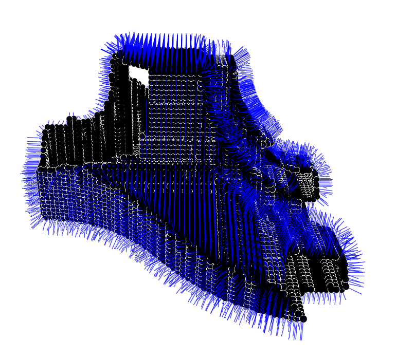

# RANSACVisualizer.jl

The goal of RANSACVisualizer.jl is to provide some basic methods to visualize point clouds and the results of the RANSAC algorithm runs, based on [RANSAC.jl](https://github.com/cserteGT3/RANSAC.jl), while separating dependencies that have impact on loading times.
[Makie.jl](https://github.com/JuliaPlots/Makie.jl) is used to achieve these goals.
See its [docs](https://csertegt3.github.io/RANSAC.jl/stable/) for [examples](https://csertegt3.github.io/RANSAC.jl/stable/example/).

## Plot a point cloud with surface normals

`showgeometry()` plots he points and also the surface normals.

```@docs
showgeometry
showgeometry!
```

The result should look something like this:



## Color the result according to the primitives type

Based on a `PointCloud` and an array of `ScoredShape`s, plot the points and color them according to their type.

```@docs
showbytype
showbytype!
```

You should see something similar:


## Color the primitives randomly

Plot the result of a run, but color every primitive differently.
Currently `ColorSchemes.gnuplot` is sampled from beginning to the end by the number of primitives.

```@docs
showshapes
showshapes!
```

This should result in something similar:

